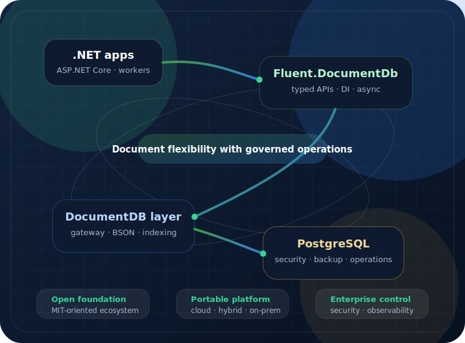

# Fluent.DocumentDb

Enterprise document workloads on PostgreSQL

<h1 class="display-2 fw-bold">Document flexibility. PostgreSQL confidence.</h1>

Fluent.DocumentDb gives .NET teams a typed, testable integration layer for PostgreSQL-backed document workloads.

<a class="btn btn-primary btn-lg me-2" href="articles/getting-started.md">Get Started</a><a class="btn btn-outline-primary btn-lg me-2" href="articles/enterprise-readiness.md">Enterprise Readiness</a><a class="btn btn-outline-primary btn-lg" href="api/index.md">API Reference</a>

PostgreSQL-backedDocumentDB directionJSONB/BSON-awareCloud & on-premises

<section class="home-section home-section-tight">

Why it matters

<h2>Document speed with enterprise control</h2>

Use a document model where it fits, while keeping the operational discipline large organizations expect from PostgreSQL: security, backup, monitoring, indexing and deployment governance.

<strong>Document model</strong>flexible records for evolving business data

<strong>.NET surface</strong>small async APIs, DI and testable contracts

<strong>PostgreSQL base</strong>operations, governance and portability

</section>

<section class="home-section">

Capabilities

<h2>Focused building blocks</h2>

<a class="capability-card" href="articles/what-is-documentdb.md">◆<h3>DocumentDB foundation</h3>
Understand the open-source PostgreSQL-backed document database direction.
</a>
<a class="capability-card" href="articles/document-store.md">λ<h3>Typed document APIs</h3>
Work with clear .NET contracts instead of leaking storage details everywhere.
</a>
<a class="capability-card" href="articles/jsonb-in-postgresql.md">⬡<h3>JSONB-aware design</h3>
Know when PostgreSQL JSONB helps and where document boundaries matter.
</a>
<a class="capability-card" href="articles/event-store.md">↗<h3>Event Sourcing path</h3>
Append facts, rebuild state and keep business history explicit.
</a>
<a class="capability-card" href="articles/cqrs-event-sourcing.md">⇄<h3>CQRS read models</h3>
Separate writes from optimized query views for complex enterprise workflows.
</a>
<a class="capability-card" href="articles/enterprise-readiness.md">◈<h3>Enterprise posture</h3>
Plan security, scale, operations and governance before production rollout.
</a>

</section>

<section class="home-section">

Adoption path

<h2>From evaluation to platform approval</h2>

Keep the library boundary small, then validate the database platform with security, operations and architecture teams.

01<h3>Evaluate</h3>
Test the API and document model locally.

02<h3>Validate</h3>
Review secrets, TLS, roles, backup and observability.

03<h3>Operate</h3>
Define indexes, capacity, retention and failure modes.

</section>

## Start here

  

    <a class="concept-card" href="articles/getting-started.md"><h3>Getting Started</h3>
Install packages and wire the first service.
</a>
  

  

    <a class="concept-card" href="articles/why-documentdb.md"><h3>Why DocumentDB</h3>
The strategic value of PostgreSQL-backed documents.
</a>
  

  

    <a class="concept-card" href="articles/postgresql-foundation.md"><h3>PostgreSQL foundation</h3>
How the storage and operations model fits together.
</a>
  

  

    <a class="concept-card" href="articles/packages.md"><h3>Packages</h3>
Core library and dependency injection extensions.
</a>
  

  

    <a class="concept-card" href="articles/document-store.md"><h3>Document Store</h3>
The main typed persistence contract.
</a>
  

  

    <a class="concept-card" href="articles/configuration.md"><h3>Configuration</h3>
Connection strings, partition keys and runtime setup.
</a>
  

Fluent.DocumentDb is MIT licensed and hosted at <a href="https://github.com/open-fluent/documentdb">open-fluent/documentdb</a>.

